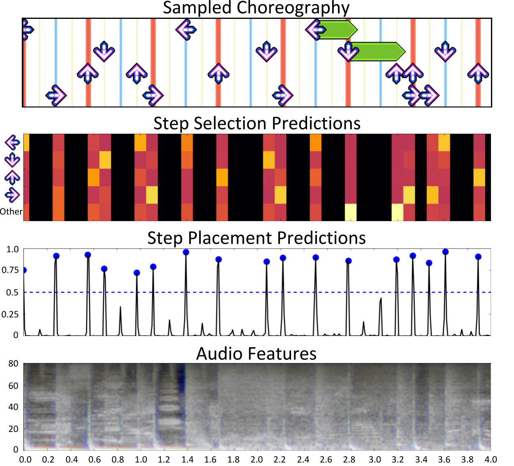

# Dance Dance Convolution

Dance Dance Convolution is an automatic choreography system for Dance Dance Revolution (DDR), converting raw audio into playable dances.

<p align="center">
    
</p>

This repository contains the code used to produce the dataset and results in the [Dance Dance Convolution paper](https://arxiv.org/abs/1703.06891). You can find a live demo of our system [here](https://ddc.chrisdonahue.com) as well as an example [video](https://www.youtube.com/watch?v=yUc3O237p9M).

The `Fraxtil` and `In The Groove` datasets from the paper are amalgamations of three and two StepMania "packs" respectively. Instructions for downloading these packs and building the datasets can be found below.

We are in the process of reimplementing this code (under branch `master_v2`), primarily to add on-the-fly feature extraction and remove the essentia dependency. However, you can get started with `master` if you are eager to dance.

Please email me with any issues: cdonahue \[@at@\] ucsd \(.dot.\) edu

## Attribution
If you use this dataset in your research, cite via the following BibTex:

```
@inproceedings{donahue2017dance,
  title={Dance Dance Convolution},
  author={Donahue, Chris and Lipton, Zachary C and McAuley, Julian},
  booktitle={Proceedings of the 34th International Conference on Machine Learning},
  year={2017},
}
```

# Requirements

* tensorflow >1.0
* [essentia 2.1 beta 3](https://github.com/MTG/essentia/releases/tag/v2.1_beta3)
* numpy
* tqdm
* scipy

# Directory description

* `dataset/`: code to generate the dataset from StepMania files
* `infer/`: code to run [demo](http://deepx.ucsd.edu/ddc) locally
* `learn/`: code to train step placement (onset) and selection (sym) models
* `scripts/`: shell scripts to build the dataset (`smd_*`) and train (`sml_*`)

# Running demo locally

The demo (unfortunately) requires tensorflow 0.12.1 and essentia. `virtualenv` recommended

1. Install [tensorflow 0.12.1](https://www.tensorflow.org/versions/r0.12/get_started/os_setup)
1. Run server: `./ddc_server.sh`
1. Send server choreography requests: `python ddc_client.py $ARTIST_NAME $SONG_TITLE $FILEPATH`

# Building dataset

1. Make a directory named `data` under `~/ddc` (or change `scripts/var.sh` to point to a different directory)
1. Under `data`, make directories `raw`, `json_raw` and `json_filt`
1. Under `data/raw`, make directories `fraxtil` and `itg`
1. Under `data/raw/fraxil`, download and unzip:
    * [(Fraxtil) Tsunamix III](https://fra.xtil.net/simfiles/data/tsunamix/III/Tsunamix%20III%20[SM5].zip)
    * [(Fraxtil) Fraxtil's Arrow Arrangements](https://fra.xtil.net/simfiles/data/arrowarrangements/Fraxtil's%20Arrow%20Arrangements%20[SM5].zip)
    * [(Fraxtil) Fraxtil's Beast Beats](https://fra.xtil.net/simfiles/data/beastbeats/Fraxtil's%20Beast%20Beats%20[SM5].zip)
1. Under `data/raw/itg`, download and unzip:
    * [(ITG) In The Groove](http://stepmaniaonline.net/downloads/packs/In%20The%20Groove%201.zip)
    * [(ITG) In The Groove 2](http://stepmaniaonline.net/downloads/packs/In%20The%20Groove%202.zip)
1. Navigate to `scripts/`
1. Parse `.sm` files to JSON: `./all.sh ./smd_1_extract.sh`
1. Filter JSON files (removing mines, etc.): `./all.sh ./smd_2_filter.sh`
1. Split dataset 80/10/10: `./all.sh ./smd_3_dataset.sh`
1. Analyze dataset (e.g.): `./smd_4_analyze.sh fraxtil`

# Running training

1. Navigate to `scripts/`
1. Extract features: `./all.sh ./sml_onset_0_extract.sh`
1. Generate chart `.pkl` files (this may take a while): `./all.sh ./sml_onset_1_chart.sh`
1. Train a step placement (onset detection) model on a dataset: `./sml_onset_2_train.sh fraxtil`
1. Train a step selection (symbolic) model on a dataset: `./sml_sym_2_train.sh fraxtil`
1. Train and evaluate a Laplace-smoothed 5gram model on a dataset: `./sml_sym_2_mark.sh fraxtil 5`
